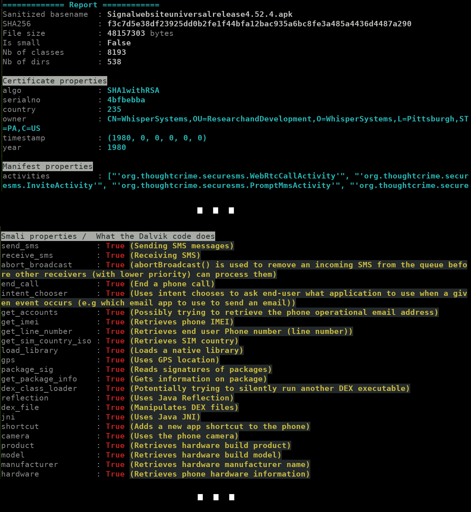

# DroidLysis

DroidLysis is a **property extractor for Android apps**.
It automatically disassembles the Android application you provide
and looks for various properties within the package or its disassembly.

DroidLysis can be used over Android packages (apk), Dalvik executables (dex), Zip files (zip), Rar files (rar) or directories of files.


## Quick setup

Can't wait to use DroidLysis? Then, use a Docker container:

```
$ docker pull cryptax/droidlysis:2021.04
$ docker run -it --rm -v /tmp/share:/share cryptax/droidlysis:2021.04  /bin/bash
```

DroidLysis is located in `/opt/droidlysis`.

## Installing DroidLysis

1. Install required system packages
2. Install Android disassembly tools
3. Get DroidLysis from the Git repository or from pip
4. Configure `droidconfig.py`

### Step1: Install required system packages

`sudo apt-get install default-jre git python3 python3-pip unzip wget libmagic-dev libxml2-dev libxslt-dev`

### Step 2: Install Android disassembly tools

DroidLysis does not perform the disassembly itself, but relies on other tools to do so. Therefore, you must install:

- [Apktool](https://ibotpeaches.github.io/Apktool/) - note we only need the Jar.
- [Baksmali](https://bitbucket.org/JesusFreke/smali/downloads) - note we only need the Jar.

Optionally:

- [Dex2jar](https://github.com/pxb1988/dex2jar) - dex2jar is now *optional*. If you don't need Dex to Jar transformation (useful for later decompiling!), you can skip it.
- [Procyon](https://bitbucket.org/mstrobel/procyon/wiki/Java%20Decompiler) - *optional*. If you don't want to use this decompiler, skip its installation.

Some of these tools are redundant, but sometimes one fails on a sample while another does not. DroidLysis detects this and tries to switch to a tool that works for the sample.

For example,

```
$ mkdir -p ~/softs
$ cd ~/softs
$ wget https://bitbucket.org/iBotPeaches/apktool/downloads/apktool_2.6.0.jar
$ wget https://bitbucket.org/JesusFreke/smali/downloads/baksmali-2.5.2.jar
$ wget https://github.com/pxb1988/dex2jar/files/1867564/dex-tools-2.1-SNAPSHOT.zip
$ unzip dex-tools-2.1-SNAPSHOT.zip
$ rm -f dex-tools-2.1-SNAPSHOT.zip
```

### Step 3a. Get DroidLysis from the Git Repository

This is the most up-to-date version.


```
$ git clone https://github.com/cryptax/droidlysis
$ cd droidlysis
$ pip3 install -r requirements.txt
```

### Step 3b. Get DroidLysis from Pypi

Alternatively, you can install DroidLysis from pip3. Note the package may be slightly behind the git repository.

```
$ python3 -m venv droidlysis
$ cd droidlysis
$ source ./bin/activate
(droidlysis) /droidlysis # pip3 install droidlysis
```

### Step 4. Configure `droidconfig.py`

The configuration is extremely simple, you only need to tune `droidconfig.py`:

- `APKTOOL_JAR`: set the path to your apktool jar
- `BAKSMALI_JAR`: set the path to your baksmali jar
- `DEX2JAR_CMD`: set the path to the folder containing `d2j-dex2.jar.sh`. If you did not install dex2jar, simply provide an invalid path here, for example pointing to a non-existant file.
- `PROCYON_JAR`: set the path to the procyon decompiler jar. If you don't want Procyon, leave this path to a non existant file.
- `INSTALL_DIR`: set the path to your DroidLysis instance. Do not forget to set this or DroidLysis won't work correctly!

Example:

```python
APKTOOL_JAR = os.path.join( os.path.expanduser("~/softs"), "apktool_2.5.0.jar")
BAKSMALI_JAR = os.path.join(os.path.expanduser("~/softs"), "baksmali-2.5.2.jar")
DEX2JAR_CMD = os.path.join(os.path.expanduser("~/softs/dex-tools-2.1-SNAPSHOT"), "d2j-dex2jar.s
h")
PROCYON_JAR = os.path.join( os.path.expanduser("~/softs"), "procyon-decompiler-0.5.36.jar")
INSTALL_DIR = os.path.expanduser("~/droidlysis")
```

Optionally, if you need a specific situation, you might need to tune the following too. Normally, the default options will work and you won't have to touch these:
- `SQLALCHEMY`: specify your SQL database.
- `KEYTOOL`: absolute path of `keytool` which generally ships with Java
- `SMALI_CONFIGFILE`: smali patterns
- `WIDE_CONFIGFILE`: resource patterns
- `ARM_CONFIGFILE`: ARM executable patterns
- `KIT_CONFIGFILE`: 3rd party SDK patterns


## Usage

DroidLysis uses **Python 3**. To launch it and get options:

```
python3 ./droidlysis3.py --help
```

For example, test it on [Signal's APK](https://signal.org/android/apk/):

```
python3 ./droidlysis3.py --input Signal-website-universal-release-4.52.4.apk --output /tmp
```



DroidLysis outputs:

- A summary on the console (see example.png)
- The unzipped, pre-processed sample in a subdirectory of your output dir. The subdirectory is named using the sample's filename and sha256 sum. For example, if we analyze the Signal application and set `--output /tmp`, the analysis will be written to `/tmp/Signalwebsiteuniversalrelease4.52.4.apk-f3c7d5e38df23925dd0b2fe1f44bfa12bac935a6bc8fe3a485a4436d4487a290`.
- A database (by default, SQLite `droidlysis.db`) containing properties it noticed.

## Options

Get usage with `python3 ./droidlysis3.py --help`

- The input can be a file or a directory of files to recursively look into. DroidLysis knows how to process Android packages, DEX, ODEX and ARM executables, ZIP, RAR. DroidLysis won't fail on other type of files (unless there is a bug...) but won't be able to understand the content.

- When processing directories of files, it is typically quite helpful to move processed samples to another location to know what has been processed. This is handled by option `--movein`.  Also, if you are only interested in statistics, you should probably clear the output directory which contains detailed information for each sample: this is option `--clearoutput`.

- When dealing with single samples, on the contrary, statistics are typically not so interesting, and their generation can be disabled with `--disable-sql`

- DEX decompilation is quite long with Procyon, so this option is disabled by default. If you want to decompile to Java, use `--enable-procyon`.

- DroidLysis's analysis does not inspect known 3rd party SDK by default, i.e. for instance it won't report any suspicious activity from these. If you want them to be inspected, use option `--no-kit-exception`. This usually creates many more detected properties for the sample, as SDKs (e.g. advertisment) use lots of flagged APIs (get GPS location, get IMEI, get IMSI, HTTP POST...).

## Sample output directory (`--output DIR`)

This directory contains (when applicable):

- A readable `AndroidManifest.xml`
- Readable resources in `res`
- Libraries `lib`, assets `assets`
- Disassembled Smali code: `smali` (and others)
- Package meta information: `META-INF`
- Package contents when simply unzipped in `./unzipped`
- DEX executable `classes.dex` (and others), and converted to jar: `classes-dex2jar.jar`, and unjarred in `./unjarred`

The following files are generated by DroidLysis:

- `autoanalysis.md`: lists each pattern DroidLysis detected and where.
- `report.md`: same as what was printed on the console

If you do not need the sample output directory to be generated, use the option `--clearoutput`.

## SQLite database

If you want to process a directory of samples, you'll probably like to store the properties DroidLysis found in a database, to easily parse and query the findings. In that case, use the option `--enable-sql`. This will automatically dump all results in a database named `droidlysis.db`, in a table named `samples`. Each entry in the table is relative to a given sample. Each column is properties DroidLysis tracks.

For example, to retrieve all filename, SHA256 sum and smali properties of the database:

```
sqlite> select sha256, sanitized_basename, smali_properties from samples;
f3c7d5e38df23925dd0b2fe1f44bfa12bac935a6bc8fe3a485a4436d4487a290|Signalwebsiteuniversalrelease4.52.4.apk|{"send_sms": true, "receive_sms": true, "abort_broadcast": true, "call": false, "email": false, "answer_call": false, "end_call": true, "phone_number": false, "intent_chooser": true, "get_accounts": true, "contacts": false, "get_imei": true, "get_external_storage_stage": false, "get_imsi": false, "get_network_operator": false, "get_active_network_info": false, "get_line_number": true, "get_sim_country_iso": true,
...
```

## Property patterns

What DroidLysis detects can be configured and extended in the files of the `./conf` directory.

A pattern consist of:

- a **tag** name: example `send_sms`. This is to name the property. Must be unique across the `.conf` file.
- a **pattern**: this is a regexp to be matched. Ex: `;->sendTextMessage|;->sendMultipartTextMessage|SmsManager;->sendDataMessage`. In the `smali.conf` file, this regexp is match on Smali code. In this particular case, there are 3 different ways to send SMS messages from the code: sendTextMessage, sendMultipartTextMessage and sendDataMessage.
- a **description** (optional): explains the importance of the property and what it means.

```
[send_sms]
pattern=;->sendTextMessage|;->sendMultipartTextMessage|SmsManager;->sendDataMessage
description=Sending SMS messages
```


## To do

- The code is quite crappy now. I could probably do the same in less lines!
- Replace print by logging
- Remove the "caution: filename not matched:  classes6.dex" which occurs at file extraction in droidsample.py

## Updates

v3.4.0 - Multidex support
v3.3.1 - Improving detection of Base64 strings
v3.3.0 - Dumping data to JSON
v3.2.1 - IP address detection
v3.2.0 - Dex2jar is optional
v3.1.0 - Detection of Base64 strings


